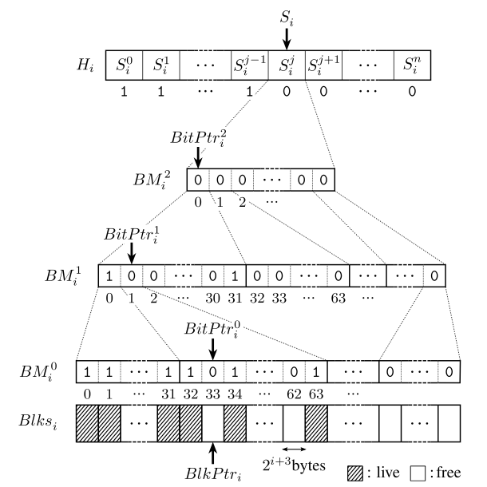
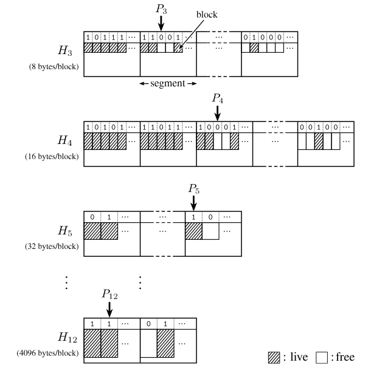

# An Efficient Non-Moving Garbage Collector for Functional Languages

以下の適当な翻訳です。

http://www.pllab.riec.tohoku.ac.jp/papers/icfp2011UenoOhoriOtomoAuthorVersion.pdf

こちらも参考になると思います。

http://www.pllab.riec.tohoku.ac.jp/~katsu/slide-20110920.pdf

smlsharpのソースコード：

https://github.com/smlsharp/smlsharp/tree/master/src/runtime
https://github.com/smlsharp/smlsharp/blob/master/src/runtime/heap_malloc.c 67行 mallocするだけ
https://github.com/smlsharp/smlsharp/blob/master/src/runtime/heap_cheney.c 730行
https://github.com/smlsharp/smlsharp/blob/master/src/runtime/heap_reppy.c 1095行
https://github.com/smlsharp/smlsharp/blob/master/src/runtime/heap_otomo.c 1512行
https://github.com/smlsharp/smlsharp/blob/master/src/runtime/heap_concurrent.c 2327行
https://github.com/smlsharp/smlsharp/blob/master/src/runtime/heap_bitmap.c 2669
Katsuhiro Ueno Atsushi Ohori Toshiaki Otomo ∗

Research Institute of Electrical Communication

Tohoku University

{katsu, ohori, o-toshi}@riec.tohoku.ac.jp

## Abstract

<sup><sub>
inter-operate 相互運用
efficient 効率的な
consist of 構成される
exponentially 指数関数的に
increasing 増加
Actual 現実の
reclaimed 再要求
maintains 維持
</sub></sup>

> <sup><sub>
Motivated by __developing a memory management system__ that allows __functional languages to seamlessly inter-operate with C__,
__we__ propose __an efficient non-moving garbage collection algorithm based on bitmap marking__ and report __its implementation and performance evaluation__.

__メモリ管理システムの開発__の目的は、__関数型言語とC言語のシームレスな相互運用__を可能にする事で、
__我々__は__効率的なbitmap markingwベースとしたnon-movingガーベジコレクションアルゴリズム__を提案し、そして__実装とパフォーマンスの評価__を報告します。

> <sup><sub>
In __our method__,
__the heap__ consists of __sub-heaps {Hi | c ≤ i ≤ B} of exponentially increasing allocation sizes (Hi for 2i bytes)__ and __a special sub-heap for exceptionally large objects__.

__我々の手法__では、__ヒープ__は__指数関数的に増加するアロケーションサイズ(2iバイトのHi)の複数のサブヒープ{Hi | c ≤ i ≤ B}__ と__指数関数的に大きなオブジェクト用の特殊なサブヒープ__で構成されます。

> <sup><sub>
__Actual space for each sub-heap__ is __dynamically allocated__ and reclaimed from __a pool of fixed size allocation segments__.

__各サブヒープの実際の空間__は__動的に確保され__、そして__アロケーションセグメントのサイズにあわせたプール__から要求されたものです。

> <sup><sub>
In __each allocation segment__,
__the algorithm__ maintains __a bitmap representing the set of live objects__.

__各々のアロケーションセグメント内__では、
__アルゴリズム__は__生存オブジェクトの集合のビットマップ表現__を維持します。

> <sup><sub>
__Allocation__ is done by __searching for the next free bit in the bitmap__.

__アロケーション__は__ビットマップ中の次のフリーなビットから検索することにより__行われます。

<sup><sub>
summarize 要約する
hierarchically 階層的に
hierarchy 階層
significant 重要な
beneficial 有益
</sub></sup>

> <sup><sub>
By adding __meta-level bitmaps__ that summarize __the contents of bitmaps hierarchically__ and maintaining __the current bit position in the bitmap hierarchy__,
__the next free bit__ can be found in __a small constant time for most cases__,
and in __log32(segmentSize) time in the worst case on a 32-bit architecture__.

__ビットマップ階層のコンテンツ__をサマライズし、そして__ビットマップ階層の現在ビット位置__を維持する事で __メタレベルビットマップ__を追加し、
__次のフリーなビット__の検索は__多くの場合小さな定数時間__で終わり、
__32bitアーキティクチャ上のワーストケースではlog32(セグメントサイズ)時間__で検索可能です。

> <sup><sub>
__The collection__ is done by __clearing the bitmaps and tracing live objects__.

__コレクション__は__ビットマップのクリアと生存オブジェクトのトレーシング__によって行われます。

> <sup><sub>
__The algorithm__ can be extended to __generational GC by maintaining multiple bitmaps for the same heap space__.

__アルゴリズム__ は__同じようなヒープスペースの管理する複数ビットマップ事により世代別GC__へ拡張出来ます。

> <sup><sub>
__The proposed method__ does not require __compaction__ and __objects__ are not moved __at all__. __This property__ is __significant for a functional language to inter-operate with C__,
and __it__ should also be __beneficial in supporting multiple native threads__.

__提案手法__ では __コンパクション__は必要とせず、__オブジェクト__は__全く__動かしません。__この性質__は __関数型言語とC言語の相互運用をするために重要__で、 __ネイティブなマルチスレッドのサポートをする上では__なくてはなりません。

> <sup><sub>
__The proposed method__ has been implemented in __a full-scale Standard ML compiler__.

__提案手法__は__フルスケールのStandard ML コンパイラ__で実装されています。

> <sup><sub>
__Our benchmark tests__ show that __our nonmoving collector__ performs as efficiently as __a generational copying collector designed for functional languages__.

__我々のベンチマークテスト__では__我々のnonmoving コレクタ__は__関数型言語用に設計された世代別コピーコレクタ__と同様の効率的なパフォーマンスであることを示しています。

## 1. Introduction

<sup><sub>
interoperability 相互運用性
partially 部分的に
achieved 達成
as well as 及び
therefore 故に
</sub></sup>

> <sup><sub>
__The general motivation of this research__ is __to develop a memory management system for a functional language__ that supports __seamless interoperability with the C language__.

__この研究の一般的モチベーション__は__C言語とのシームレスな相互運用__をサポートした__関数型言語用のメモリ管理システムの開発__です。

> <sup><sub>
__We__ have partially achieved __this goal through type-directed compilation for natural data representations in ML [25]__.

__我々__はこの目標を__MLでの自然なデータ表現の型の直接的なコンパイル[25]__ で部分的に達成しました。

> <sup><sub>
Under __this scheme__, __ML records and arrays as well as atomic types such as int and real__ have __the same representation as in C__ and are __therefore directly read or updated by a C program without any data representation conversion__.

__このスキーム__下では、__MLレコードと配列及びintやreal等のアトミックなタイプ__は__Cと同じ表現__をもち、そして__データ表現の変換無しに、Cプログラムから直接的に読み込め、更新__できます。

<sup><sub>
embodied 具体化
fragment 断片
distributed 分散型の
</sub></sup>

> <sup><sub>
__This__ has been embodied in __our SML# compiler [33]__.

これは、__SML# コンパイラ[33]__で具体化されています。

> <sup><sub>
In __this implementation__, __one__ can directly import __a C function__ and call __it with data structures such as records, mutable arrays, and function closures (for call-backs) created in SML#__.

__この実装__の中で、__Cの関数__は直接インポート出来て、__レコード、更新可能な配列、SML#で作成されたコールバック用の関数クロージャのようなデータ構造__を呼び出せます。

> <sup><sub>
__The following code__ is __a fragment of a demo program distributed with SML#__.

__以下のコード__は__SML#のデモプログラムのディストリビューション内の断片__です。

```
val glNormal3dv =
    dlsym (libgl, "glNormal3dv")
    : _import (real * real * real) -> unit
...
  map (fn (vec, ...) => (glNormal3dv vec; ...))
    [((1.0, 0.0, 0.0), ...), ...]
```

<sup><sub>
precision 精密
correctly 正しく
indicating 示します
whether かどうか
exactly 正確に
adopting 採用
should be able to achieve 達成することができるはずです
interoperability 相互運用性
</sub></sup>

> <sup><sub>
__This code__ dynamically links __glNormal3dv function in the OpenGL library as an ML function of type real * real * real -> unit__ and uses __it with other SML# code__.

__このコード__は__型 real * real * real -> unit のML関数であるOpenGLライブラリ内のglNormal3dv関数__を動的にリンクし、 そして__他のSML#コードで__使います。

> <sup><sub>
__SML#__ compiles __(1.0, 0.0, 0.0)__ to __a pointer to a heap block containing 3 double precision floating point numbers__.

__SML#__は__(1.0, 0.0, 0.0)__を3つのdoubleにコンパイルします。

> <sup><sub>
Since __this record__ has __the same representation as a double array of C__, __glNormal3dv__ works __correctly__.

なぜなら__レコード__が__Cのdouble配列と同じ表現__持っているため、__glNormal3dv__は__正確に__働きます。

> <sup><sub>
In __addition to this natural data representation__, __each SML# heap object__ has __a header containing object layout information indicating__ whether __each field__ is __a pointer or not__.

__この自然なデータ表現の追加__により、__各SML#ヒープオブジェクト__は__各フィールド__が__ポインタかそうでないか__を__示すオブジェクトレイアウト情報を含んだヘッダ__を持っています。

> <sup><sub>
__This information__ is used __by the SML# garbage collector (GC) to exactly trace live objects__.

__この情報__は__正確に行きているオブジェクトをトレースするためにSML#ガーベジコレクター(GC)によって__使われています。

> <sup><sub>
By __adopting the strategy__ that __the SML# GC__ only traces and collects __SML# objects__ and leaves __management of C allocated objects to C code__, __we__ should be able to achieve __seamless interoperability between SML# and C__.

__SML# GC__が__SML#のオブジェクト__をトレースしコレクトし、そして__Cコード用にCがアロケートしたオブジェクトの管理__を残す戦略を採用する事で、我々は__シームレスなSML#とCの相互運用を__達成することができるはずです。

<sup><sub>
so far これまでの
as well as だけでなく
</sub></sup>

> <sup><sub>
__The solution so far__ is however __only partial__ in that __data structures__ that are passed to __foreign functions__ must be allocated in __a special non-moving area__.

__これまでのソリューション__ではしかしながら__外部関数__は__特別なnon-movingエリア__内にアロケーションされる必要性があることから__データ構造__の中の部分的なもののみでした。

<sup><sub>
commonly 一般的に
accepted に受け入れられ
belief 信念
being であること
amount 量
would be なります
</sub></sup>

> <sup><sub>
__SML# compiler__,
__as well as most other functional language compilers__,
has used __copying garbage collection (GC) based on the commonly accepted belief being__ that,
__for functional programs requiring large amount of short-lived data__,
__the Cheney’s copying collector [8]__ would be __the most efficient for their minor collection__.

__SML#コンパイラ__、
__だけでなく多くの他の関数型言語コンパイラ__、
__一般的に受け入れられ信用のあるベースとなるコピーガーベジコレクション(GC)__を使っています、
__関数プログラムは短命な大量のデータ__を必要とし、
__Cheneyのコピーコレクタ[8]__は__それらのマイナーコレクション用のより効率的に__なります。
。


<sup><sub>
precise 正確な
prohibits 禁止する
inter-operating 相互動作
</sub></sup>


> <sup><sub>
However, __any (precise) copying GC__ requires that __the runtime system__ must be able __to locate and update all the pointers to each heap allocated data__.

しかしながら、多くの(正確な)コピーGCは__ランタイムシステム__が__ヒープアロケーションされたデータの全てのポインター再配置と更新__が可能である事が必要です。

> <sup><sub>
__This__ prohibits __functional programs from inter-operating with foreign functions or any programs__ that use __local memory space__ not accessible from __the garbage collector__.

__これ__は__外部関数か別のプログラムによる相互動作からの関数的プログラム__を禁止し、__ガーベジコレクタ__からアクセス出来ない__ローカルメモリ空間__を使います。

<sup><sub>
side-step サイドステップ
explicitly 明示的
</sub></sup>

> <sup><sub>
To __side-step this problem__, __the programmer__ must explicitly request __GC__ not to move __those data__ that are passed to __external code__.

__この問題のサイドステップ__から、__プログラマ__は__外部コード__へ渡されたそれらのデータは動かない正確な_GC_を要求します。

<sup><sub>
object pinning オブジェクトのピン止め
cumbersome 面倒な
not only A but also B AだけでなくBも
</sub></sup>

> <sup><sub>
__This “object pinning” approach__ is not only __cumbersome__ but also __dangerous__.

__"オブジェクトピン留め"アプローチ__は__面倒__なだけではなく、__危険__でもあります。

<sup><sub>
should be でなければなりません
painfully 苦痛なほど
familiar おなじみの
anyone 誰でも
interacts 相互作用
</sub></sup>

> <sup><sub>
__This problem__ should be __painfully familiar to anyone__ who has tried __to write a functional program__ that interacts with __a foreign library__ that requires __callbacks or locally stores object pointers passed from the caller__.

__関数プログラムを書くこと__を試みた __誰にでも苦痛な程おなじみの__ __この問題__ は __コールバックまたは呼び出し元から渡されたローカルストアのオブジェクトポインタ__を必要とする __外部ライブラリ__ との相互作用ができなければなりません。

<sup><sub>
rather むしろ
interoperability 相互運用性
provide 提供します
</sub></sup>

> <sup><sub>
For __a language with rather limited interoperability__,
__“object pinning”__ might be performed __automatically__,
but for __an MLstyle language__ that provides __seamless interoperability, automatic “object pinning”__ is __difficult, if not impossible__.

むしろ限定された相互運用性の言語のために、__オブジェクトピン留め__ は自動的に働くでしょう、しかし__MLスタイルの言語__では シームレスに相互運用性を提供する事、自動的なオブジェクトのピン留めは難しいですが、不可能ではありません。

<sup><sub>
suppose 仮定する
</sub></sup>

> <sup><sub>
To __see the problem__,
__suppose a C function__ is called with __an array and a call-back function__.

__問題を見る__ために、__仮定するC関数__は__配列とコールバック関数__によって呼ばれます。

<sup><sub>
mutate 変異させ
estimate 推定する
entire 全体の
even those でも、それら
</sub></sup>

> <sup><sub>
Since __both the C function and the call-back function__ can freely mutate __the array__,
__the runtime system__ can only safely estimate that __the set of reachable objects from the array passed to the C function__ to be __the set of all the live objects in the entire heap__,
including even _those_ that may be __created later by the call-back function__.

なぜなら__C関数とコールバック関数の両方__は__配列を__自由に変える事が出来、
__ランタイムシステム__は唯一安全に__C関数へ渡された配列から到達可能なオブジェクトの集合__ が __ヒープ全体の全てのいきたオブジェクト__となると推定出来て、__コールバック関数で後から作られた__ それらにも含まれています。

----

<sup><sub>
suitable 適切な
rely 頼る
heavily 重く
ideally 理想的
currently 現在
widely 広く
</sub></sup>


> <sup><sub>
To __solve this problem__, we would like __to develop a non-moving garbage collection algorithm suitable for functional languages__.

__この問題をとく__には、我々は__関数型言語のための適切なnon-movingガーベジコレクションアルゴリズムを開発__しなければなりません。

> <sup><sub>
Since __functional programs__ rely __heavily on efficient allocation and collection__,
a __new non-moving GC algorithm__ should ideally be as efficient as __currently widely__ used __copying GC with generational extension [21, 35]__.

なぜならば、__関数プログラム__は__重く効率的なアロケーションとコレクション__に頼っており、 __あたらしいnon-moving GCアルゴリズム__は理想的には__現在広く使われているコピーGCの一般的な拡張 [21, 35]__ と同じくらい効率的であるべきです。

<sup><sub>
purpose 目的
feasibility 実現可能性
</sub></sup>


> <sup><sub>
__The purpose of this paper__ is to __develop such a garbage collection algorithm__,
to __implement it for a full-scale ML compiler__,
and to __evaluate its performance through extensive benchmarks to verify the feasibility of the algorithm__.

__この論文の目的__ は __そのようなガーベジコレクションアルゴリズムを開発する__事であり、
__そのフルスケールのMLコンパイラを実装する事__であり、
__そのアルゴリズムでの実現可能性の検証のための拡張のベンチマークのパフォーマンスを評価する事__です。

----

<sup><sub>
obvious 明白
candidate 候補
</sub></sup>

> <sup><sub>
__An obvious non-moving candidate__ is __mark and sweep GC[24]__ .

__明白なnon-movingの候補__は__マークアンドスイープGC [24]__ です。

<sup><sub>
tends 傾向
exhibit 展示
weaknesses 弱点
</sub></sup>

> <sup><sub>
Compared __with copying GC__, however, __simple mark and sweep GC__ tends to exhibit __the following general weaknesses__.

__コピーGC__と比べて、しかしながら、__シンプルなマーク＆スイープGC__は__以下の一般的な弱点__を示す傾向があります。

----

<sup><sub>
Fragmentation 断片化
various さまざまな
Due to に起因し、のために
becomes なります
reclamation 再利用
avoid 避ける
contrast コントラスト、対比
yields 利回り
boundary 境界
</sub></sup>

-   > <sup><sub>
    Fragmentation and slow allocation.

    断片化と遅いアロケーション。

    > <sup><sub>
    __Functional programs__ require __objects of various sizes with various life time__.

    __関数プログラミング__は__様々なライフタイムを持つ様々なサイズのオブジェクト__を必要とします。

    > <sup><sub>
    Due to this property, __the heap space__ becomes fragmented __very quickly__, resulting in __slow allocation and reclamation__.

    この性質を起因にして、__ヒープ空間__は__とても素早く__分断され、結果__アロケーションと再利用__はおそくなります。

    > <sup><sub>
    To __avoid this problem__, __practical variant of mark-and-sweep GC algorithms sometimes__ perform __costly compaction at sweep phase__.

    この問題を避けるために、マークアンドスイープGCアルゴリズムの現実的なバリアントは、しばしばスイープフェーズのコンパクションにコストをかけます。

    > <sup><sub>
    In __contrast__, __copying GC__ automatically performs __compaction__ and yields __a very fast allocator__, which has only __to check the heap boundary__ and __to advance the allocation pointer__.

    対称的に、コピーGCは自動的にコンパクションを処理し、とても高速なアロケータを使い、ここでヒープ境界のチェックとアロケーションポインタの拡張のみ行われます。

<sup><sub>
proportional 比例します
Difficulty 難易度
straightforward 単純明快
certain 一定
machinery 機械
</sub></sup>

-   > <sup><sub>
    __High sweep cost__.
    __Mark and sweep GC__ requires __to sweep the heap__, which takes __time proportional to the size of the heap__.
    __Again this__ is __in contrast with copying GC__ whose __collection cost__ is __proportional to the amount of live data__.

    高いスイープコスト。
    マークアンドスイープGCはヒープのスイープが必要です、ヒープサイズに比例する時間がかかります。
    これはまたコピーGCと対比的で、コピーGCのコレクションコストは生存データの量に比例します。

-   > <sup><sub>
    __Difficulty in developing efficient generational GC__.
    While __it__ is __straightforward to combine mark and sweep GC with other GC to form a generational GC__,
    __developing generational mark and sweep GC__ requires __certain amount of additional machinery__, which would __result in slower GC time [10]__.

    効率的な世代別GCの開発における難しさ。
    世代別GCの形は他のGCよりマークアンドスイープの組み合わせは単純明快で、
    世代別マークアンドスイープGCの開発は機械的な追加を一定量必要とし、これはGC時間の結果を遅くします[10]。

<sup><sub>
Perhaps おそらく
due to に起因する
seems to be considered 考慮されると思われます
suitable 適切な
produces 生成
varied 多様な
rapidly 急速に
</sub></sup>

> <sup><sub>
Perhaps __due to these problems__, __mark and sweep GC__ seems to be __considered not suitable for primary GC (e.g. minor GC in generational GC) of functional programs__,
which produces __large amount of short-lived data of varied size very rapidly__.

おそらくこれらの問題に起因して、とても急速にたような短命の変数を大量に生成する関数プログラミングのプライマリGC用(すなわち世代別GCのマイナーGC)にはマークアンドスイープGCは適切ではないと考えられそうです。

----

<sup><sub>
technical テクニカル
contribution 貢献
demonstrate 実証します
feasibility 実現可能性
survey サーベイ
series 一連
overcome 乗り越える
mentioned 言及
summary 要約
</sub></sup>

> <sup><sub>
__The main new technical contribution of this paper__ is to develop __a variant of mark and sweep GC__ that is __as efficient as Cheney’s copying GC and its generational extensions__,
and to demonstrate __its feasibility for functional languages thorough implementation and evaluation__.

この論文のメインの新しい技術的な貢献はマークアンドスイープGCのバリアントの開発であり、これはCheneyコピーGCと同様の効率的で、世代的な拡張で、そして関数型言語の実装と評価での実現可能性を実証します。

> <sup><sub>
__Our basic strategy__ is __well known bitmap marking (see [37] and [17] for a survey.)__

我々の基本的な戦略はよく知られているビットマップマーキング([37]と[17]を参照)です。

> <sup><sub>
__We__ associate __a heap with bitmaps__ that represent __the set of live objects__.

我々は生存オブジェクトの集合を表現するビットマップのヒープに関連しています。

> <sup><sub>
__This structure alone__ does not yield __an efficient allocation and collection__.

この構造単体は効率的なアロケーションとコレクションにはyieldません。

> <sup><sub>
__We__ have developed __a series of new data structures and algorithms__ that overcome __the weakness of mark and sweep GC mentioned above__.

我々は新しいデータ構造とアルゴリズム開発しました、それを前に言及したマークアンドスイープGCでのりこえます。

> <sup><sub>
__The following__ is __a summary of the features of our GC algorithm__.

以下は我々のGCアルゴリズムの機能の要約です。

1.  > <sup><sub>
    __A fragmentation-avoided and compaction-free heap__.

    断片化を回避したコンパクションフリーなヒープ。

    > <sup><sub>
    __Fragmentation__ occurs when __objects have varied sizes__; if __all the objects__ were of __the same size__, then __the heap__ could be __a fixed size array__ that can be __managed by a bitmap without incurring fragmentation__.

    断片化は、オブジェクトがサイズの変化があるときに発生します; すべてのオブジェクトが同じサイズであった場合、ヒープは、断片化を招くことなく、ビットマップで管理することができ、固定サイズの配列である可能性があります。

    > <sup><sub>
    __An extreme idea__ is to set up __a separate heap for each object size__.

    極端な考え方は、各オブジェクトのサイズに別々のヒープを設定することです。

    > <sup><sub>
    Of course __we__ cannot prepare __sufficiently large separate heaps for all possible object sizes__,
    so __we__ prepare __a series of sub-heaps {Hi | c ≤ i} of exponentially increasing allocation block sizes__,
    i.e. __each Hi consists of allocation blocks of 2i bytes__.

    もちろん、__我々__は__別々の十分な大きさのすべての可能なオブジェクトサイズのヒープ__を準備することはできません、
    そう、__我々__は__指数関数的に増やしたアロケーションブロックサイズの一連のサブヒープ{Hi | c ≤ i}__すなわち、__各Hiで2iバイトのアロケーションブロック__を準備します。
    
    > <sup><sub>
    Actual __allocation space of Hi__ is __dynamically maintained as a list of fixed-size segments__.

    実際の__Hiの割り当てスペース__を動的固定サイズのセグメントのリストとして維持されます。

    > <sup><sub>
    __Each segment__ contains __an array of 2i-byte blocks__.

    __各セグメント__は、__2iバイトブロックの配列__が含まれています。
    
    > <sup><sub>
    __2c__ is __the minimum allocation block size in bytes__.

    __図2c__は、__バイト単位の最小割り振りブロックサイズ__です。

    > <sup><sub>
    __In SML#__, __the minimum size of non-empty objects__ is __8(2 3) byte__, so __we__ fix __c to be 3 in this paper__.

    __SML＃では__、__非空のオブジェクトの最小サイズ__は__8（23）バイトである__ので、__我々__は、__cは、本論文の3章で補足します__。

    ----

    > <sup><sub>
    __These structures__ eliminate __the fragmentation problem associated with mark and sweep collection__.

    __これらの構造__は、__マークアンドスイープコレクションに関連付けられた断片化の問題__を解消します。

    > <sup><sub>
    Since __a segment__ is __a fixed size array__,
    __it__ is efficiently maintained __by a bitmap__ where __each bit corresponds to one block__.

   なぜならば、__セグメント__は、__固定サイズの配列__だからで、__これ__は__各ビットが一つのブロックに対応する____ビットマップによって__効率的に維持されています。

    > <sup><sub>
    Moreover, __size of each Hi__ is dynamically adjusted __through allocation and reclamation of segments__.

    また、__各Hiのサイズ__は__アロケーションと、セグメントの再利用を介して__動的に調整されます。

    > <sup><sub>
    In __our scheme__, __an allocation block in Hi in general__ contains __an object smaller than 2i bytes__,
    and __some amount of memory__ is __unused__.

    __我々の方式__では、__一般的にHiのアロケーションブロック__は__2iバイトより小さいオブジェクト__が含まれており、__メモリのいくつかの量__が__使用されていません__。

    > <sup><sub>
    __Our observation__ is that, __we__ can avoid costly compaction at __the expense of locally wasting space in each allocation block__,
    and that __this cost__ is __quite acceptable in practice__.

    __我々の観察__では、__我々__はローカルに各アロケーションブロック内のスペースを無駄にすることを犠牲にして__高コストのコンパクション__を避けることができ、
    __このコスト__は__実際には非常に許容可能__であるというということです。

    > <sup><sub>
    __Our evaluation__ shows that __the space usage__ is better than __that of copying GC in most cases__.

    __我々の評価__は__スペース効率の点で__ __多くの場合コピーGC__より上回っていることを示します。


    ----

    > <sup><sub>
    Since __we__ cannot prepare __Hi for unbounded i__, __we__ set __a bound B of i__ and allocate __exceptionally large objects of size more than 2B to a special sub-heap M__.

    我々は未束縛のiについてHiを準備することはできないので、
    我々は、iに束縛されたBを設定し、
    特別なサブヒープ`M`に`2B`以上のサイズの例外的に大きなオブジェクトを割り当てます。

    > <sup><sub>
    __B__ can be __as large as the size of one segment__.

    Bは、一つのセグメントの大きさと同じ大きさであることができます。

    > <sup><sub>
    According to __our experimentation__, __B = 12 (i.e. at most 4096 bytes)__ appears __to be sufficient for functional programs (e.g. covers most of allocation requests.)__

    我々の実験によると、B=12（すなわち、最大で4096バイト）機能的なプログラムのために十分であるように思われます（例えば、割り当て要求のほとんどカバーしています。）

    > <sup><sub>
    Hence, in __our system__, __the heap consists of 10 sub-heaps__, H3, . . . H12.

    したがって、我々のシステムでは、ヒープは10個のサブヒープH3, . . . H12で構成されています。

    > <sup><sub>
    Since __the special sub-heap M__ occupies __a very small portion of the entire heap__ and can be managed by __any non-copying GC method__, __we__ do not consider __this further__.

    特殊なサブヒープMはヒープ全体のごく一部を占め、non-copying GC法で管理することができるので、我々はこれをさらに考慮していません。

2.  > <sup><sub>
    __Efficient allocation__.

    効率的なアロケーション

    <sup><sub>
    Efficient 効率的な
    proportional 比例します
    Perhaps おそらく
    due に起因します
    to hierarchically organized tree 階層的に組織化されたツリー
    ordinary 普通
    intermediate 中間の
    corresponding 対応します
    whole 全体
    depicted 示され
    explained 説明
    series 一連
    </sub></sup>

    > <sup><sub>
    __A bitmap__ can be used not only __for marking__ but also __for allocation by searching for a free bit in a bitmap__.

    ビットマップはマークなしに使う事が出来ますが、ビットマップ中にフリービットを検索するためにアロケーションします。

    ビットマップは、ビットマップ内の空きビットを検索することにより、マーキングのためだけでなく、割り当てのために使用できるだけでなく。

    > <sup><sub>
    __Simple search for a free bit in a bitmap__ takes,
    __in the worst case__,
    __the time proportional to the number of busy bits__.

    ビットマップのフリービットのシンプルな検索は、
    ワーストケースでは、
    ビジービットの数に比例した時間がかかります。

    > <sup><sub>
    Perhaps __due to this problem__, __most of bitmap based GC algorithms__ use __some form of free list for allocation__.

    おそらく、この問題に起因して、更なるビットマップGCアルゴリズムはアロケーションのフリーリストの形から、使われます。

    おそらく、この問題のため、ビットマップの最もベースのGCアルゴリズムは、割り当てのために空きリストのいくつかのフォームを使用します。


    > <sup><sub>
    __We__ solve __this problem by adding meta-level bitmaps__ that __summarize the contents of bitmaps__.

    我々はこの問題をビットマップのコンテンツのサマライズのメタレベルビットマップの追加によって解決します。

    我々は、ビットマップの内容を要約するメタレベルのビットマップを追加することによって、この問題を解決します。

    > <sup><sub>
    __The set of all bitmaps__ form __a hierarchically organized tree__.

    全てのビットマップの集合は階層的に組織されたツリーを形成します。


    すべてのビットマップのセットが階層的に組織ツリーを形成します。

    > <sup><sub>
    __The sequence of bits at the leaf level in the tree__ is __the ordinary bitmap representing liveness of the set of allocation blocks__,
    and __the sequence of bits at an intermediate level__ summarizes __the bitmap one level below__.

    > <sup><sub>
    On __this bitmap tree__,
    __we__ maintain __a data structure representing both the next bit position to be examined and the corresponding block address__.

    > <sup><sub>
    __This structure__ corresponds __to the allocation pointer of copying GC__,
    so __we__ call __it an allocation pointer__.

    > <sup><sub>
    __The whole organization__ is __depicted in Figure 2__ whose __details__ will be __explained in Section 2__.

    > <sup><sub>
    By __constructing a series of optimized searching algorithms on this data structure__,
    __the next free bit__ can be found __in a small constant time for most cases__,
    and __in log32(segmentSize) time in the worst case__.


    ツリーのリーフレベルでのビットのシーケンスは、アロケーションブロックのセットの生存性を表す一般的なビットマップです
    中間レベルでのビットのシーケンスは、以下のビットマップ1のレベルをまとめたものです。

    このビットマップツリーで、我々は検査されるべき次のビット位置と対応するブロックアドレスの両方を表すデータ構造を維持します。

    この構造は、GCのコピーの割り当てポインタに対応するので、アロケーションポインタを呼び出します。

    組織全体は、その詳細第2章で説明する図2に示されています。

    最悪の場合の時間（segmentSizeの）このデータ構造に最適化された検索アルゴリズムのシリーズを構築することにより、次のフリービットは、ほとんどの場合のための小さな定数時間で、およびlog32で見つけることができます。

3.  > <sup><sub>
    __Small GC cost__.

    > <sup><sub>
    __Sweeping__ is done __by clearing bitmaps__.

    > <sup><sub>
    __The total collection cost of a bitmap making GC__ is __the sum of the costs for clearing bitmaps__,
    __tracing live objects__,
    and __setting the bits in the bitmaps__.

    > <sup><sub>
    Among __them__,
    __the bitmap clearing__ requires __N/32 steps__ where __N__ is __the total number of allocation blocks__.

    > <sup><sub>
    Our __extensive evaluation__ shows that __bitmap clear time__ is __negligible (about 1% of the GC time)__,
    and therefore, in practice,
    __the total cost of our GC__ is __dominated by the tracing and marking cost__.

    > <sup><sub>
    So __in practice our GC algorithm__ behaves __similarly to that of copying GC__.

    小さなGCコスト。
    スウィーピングは、ビットマップを作成することによって行われます。
    ビットマップの作成GCの総回収コストは、ビットマップをクリアライブオブジェクトを追跡し、ビットマップのビットを設定するためのコストの合計です。
    その中でも、ビットマップのクリアは、Nが割り当てブロックの総数であるN/32の手順が必要です。
    クリアタイムをビットマップ我々の広範な評価のショーは無視できる（GC時間の約1％）であるため、実際には我々のGCの総コストを追跡し、マーキングコストによって支配されています。
    だから、実際には我々のGCアルゴリズムはコピーGCのと同様に動作します。

    > <sup><sub>
    In __most of the benchmark tests we performed__, __the total GC cost__ was __smaller than those of simple copying collector and generational copying collector__.

    我々が実施したベンチマークテストのほとんどでは、総GCコストは、単純なコピーコレクターと世代コピーコレクターのそれよりも小さかったです。

4.  > <sup><sub>
    __Non-moving generational GC__.
    
    > <sup><sub>
    __By adapting the idea of partial collection__ proposed __by Demers et.al. [10]__,
    __our bitmap marking GC__ scales up to __generational GC without moving objects__.

    > <sup><sub>
    __This__ is based on __our observation__ that __a bitmap__ represents __a subset of the set of objects in a heap__.

    > <sup><sub>
    __Generational GC__ can be realized by __maintaining a separate bitmap for each generation__.

    > <sup><sub>
    __The partial__ collection __with “sticky bit” technique presented in [10] coincides with a special case__ where __tenuring threshold__ is __1__ and __the number of generations__ is __2__.

    > <sup><sub>
    __Pointers to younger generations from older generations__ are tracked using __a write barrier and a remembered set__.

    > <sup><sub>
    In __the above special case__, __the remembered set__ can be allocated in __the collector’s trace stack due to the property__ that __the remembered set__ can be __flushed after minor collection__.

    > <sup><sub>
    __The resulting implementation of the special case__ does not require __any additional memory space other than those used in the non-generational version__.

    世代別GCを非移動。

    デマーズet.al.によって提案された部分集合の概念を適応させることによって、 [10]、GCのマーキング当社のビットマップオブジェクトを移動することなく、世代別GCまで拡張可能。

    これは、ビットマップは、ヒープ内のオブジェクトの集合の部分集合を表す我々の観察に基づいています。

    世代別GCは、各世代のために別個のビットマップを維持することによって実現することができます。

    しきい値を殿堂入りは1であり、世代数が2である[10]に提示「スティッキービット」技術による部分集合は、特殊なケースと一致しています。

    古い世代から若い世代へのポインタは書き込みバリアと思い出したセットを使用して追跡されます。

    上記の特殊なケースでは、思い出したセットが原因で思い出したセットがマイナーコレクション後に洗い流すことができるプロパティにコレクターのトレース・スタックに確保することができます。

    特殊なケースで得られたインプリメンテーションは、非世代のバージョンで使用されているもの以外の追加のメモリ空間を必要としません。

----

> <sup><sub>
__We__ have implemented __the data structures and algorithms in a Standard ML compiler__,
and have done __extensive benchmark tests__.

> <sup><sub>
__We__ have evaluated and compared __them against a simple Cheney’s copying GC__,
and __a generational copying GC for functional languages described in [29]__,
and have obtained __the following results__:

> <sup><sub>
(i) __segment-based dynamic sub-heap size adjustment__ automatically achieves __optimal hand-tuned sub-heap size assignment__,
(ii) __the bitmap marking GC__ is __as efficient as Cheney’s copying GC__,
and (iii) __the generational extension__ outperforms __the non-generational bitmap GC__,
and shows __comparable or better performance results compared to generational copying GC__.

> <sup><sub>
__These results__ demonstrate that __our development__ have achieved __the goal of developing a nonmoving GC method for functional language__.

> <sup><sub>
__The proposed method__ has __additional advantage of supporting multiple native threads without much additional machinery__.

> <sup><sub>
__Our segment-based heap organization__ allows __each concurrent thread to allocate objects in a shared global heap without any locking__.

我々は、標準的なMLコンパイラのデータ構造とアルゴリズムを実装しており、大規模なベンチマークテストを行っています。

我々は評価し、比較して、簡単なチェイニーのコピーGCに対して、および[29]に記載されている機能の言語の世代コピーGC、以下の結果を得ているしています：

（ⅰ）セグメントベースのダイナミックサブヒープサイズの調整が自動的に（ii）のビ​​ットマップマーキングGCはチェイニーのコピーGCほど効率的で、最適な手にチューニングされたサブヒープサイズの割り当てを達成し、および（iii）世代の拡張は、非よりも性能が優れています世代ビットマップGC、および世代コピーGCと比べて、同等以上の性能の結果を示しています。

これらの結果は、我々の開発は関数型言語のために動かないGC法を開発するという目標を達成していることを示しています。

提案された方法は、非常に追加の機械ことなく、複数のネイティブスレッドをサポートする追加の利点を有します。

当社のセグメントベースのヒープ組織は各同時スレッドが任意のロックなしで共有グローバルヒープ内のオブジェクトを割り当てることができます。

<sup><sub>
preliminary 予備
promising 有望
</sub></sup>

> <sup><sub>
__The detailed implementation and evaluation for multithread extension__ is __out of the scope of the present paper__, but __our preliminary implementation of multithread extension__ shows __promising result__.

マルチスレッド拡張の実装と評価の詳細はこのペーパーの範囲を超えますが、我々の予備のマルチスレッドの実装で有望な結果を示しています。

> <sup><sub>
__All the implementation__ is done __in our SML# compiler__, which compiles __the full set of Standard ML language (with the (mostly) seamless interoperability with C) into x86 native code__.

全ての実装は我々のSML#コンパイラで完了しており、これはx８６ネイティブコード上で(シームレスにC言語と相互運用する)Standard ML言語フルセットコンパイルを行います。

> <sup><sub>
__SML# version 0.40 or later__ includes __the GC algorithms reported in this paper__,
and __they__ are __available and enabled by default in x86 native compilation mode__.

SML# version 0.40以降でこの論文で報告されたGCのアルゴリズムが含まれており、これらはx86ネイティブコンパイルモードでデフォルトで使用可能です。

> <sup><sub>
__The rest of the paper__ is __organized as follows__.

論文の残りは以下のような編成です。

> <sup><sub>
__Section 2__ presents __the bitmap marking GC algorithm__.
__Section 3__ extends __the GC method to generational GC__.
__Section 4__ reports __implementation and performance evaluation__.
__Section 5__ compares __the contribution with related works__.
__Section 6__ concludes __the paper__.

2章では、bitmap マーキングGCアルゴリズムを提案します。
3章では、世代別GCのGCの手法を拡張します。
4章では、実装とパフォーマンスの評価を報告します。
5章では、他の研究と貢献を比較します。
6章では、この論文のまとめます。

## 2. The bitmap marking GC

> <sup><sub>
This section describes the details of the data structures and algorithms for the bitmap marking GC.
This description involves lowlevel bit manipulation.
To achieve efficient allocation with bitmaps,
we found it essential to design data structures and algorithms in detail.
Accurately reporting them requires us to present them in details,
sometimes referring to bit-level manipulation.
For this reason,
we use C like syntax in describing the algorithms.

このセクションでは、GCをマークするビットマップのためのデータ構造とアルゴリズムの詳細について説明します。

この説明は、低レベルのビット操作を必要とします。

ビットマップの効率的な割り当てを達成するために、
我々は、それが基本的な詳細のデータ構造及びアルゴリズムを設計が分かりました。

それらを正確に報告すること、時にはビットレベルの操作を参照して、詳細にそれらを提示するために我々を必要とします。

このために、
我々はアルゴリズムを記述する際にCのような構文を使用しています。

### 2.1 The GC-mutator interface

> <sup><sub>
Our GC is an exact tracing GC for functional languages.
It can be used with any compiler that produces objects with their layout information and maintains an exact root set.
In order to make accurate comparison with other GC algorithms, we design our GC algorithm with a uniform interface to a compiler.
For this purpose, the implementation of our GC provides a function for the mutator to register a root set enumerator, which takes a function on a heap object pointer of the following type void trace fn(void**); and applies this function to each object in a root set.
At the beginning of each GC, the collector calls all the registered root set enumerators with an appropriate trace fn function.
In the case of Cheney collector, for example, this would be a function to move an object from one semi-space to the other; in our GC, this is a function that marks the bit corresponding to an object.

我々のGCは、関数型言語のための正確なトレースGCです。

それは、そのレイアウト情報とオブジェクトを生成し、正確なルートのセットを維持する任意のコンパイラで使用することができます。

他のGCアルゴリズムとの正確な比較を行うために、我々は、コンパイラへの統一されたインタフェースで、我々のGCアルゴリズムを設計します。

この目的のために、我々のGCの実装では、fn(void**)は、次の型がvoidトレースのヒープオブジェクトのポインタに関数を受け取り、ルートセットの列挙子を登録するミューテータのための関数を提供します。ルートセット内の各オブジェクトには、この関数が適用されます。

各GCの開始時に、コレクタは、適切なトレースは、fn関数で登録されているすべてのルートセットの列挙子を呼び出します。

チェイニーコレクタの場合、例えば、これは、他の1つの半空間からオブジェクトを移動させる関数でしょう。我々のGCで、このビットは、オブジェクトに対応するマーク関数です。

----

> <sup><sub>
An allocation operation is designed as a function which takes a request size in bytes and returns a pointer to a newly allocated object.
This is the most general style of allocator required for natural data representation.
Since the size of natural data representation is different according to their types, the size of some records in a polymorphic function can only be determined at runtime.
For example, consider a function of type ’a -> ’a * ’a.
This function returns a 8 byte record for an int argument and a 16 byte record for an real argument.
Of course, for monomorphic cases, where sizes are statically known, we can inline-expand the allocation function to mutator code to produce an optimized allocation code.
For the inline-expansion, however, compiler requires detailed knowledge of the allocation function, which may vary according to GC algorithms.
To make the compiler independent of GC methods, in this paper, we turn off the inlining.

割り当て操作は、バイト単位で要求サイズを取り、新しく割り当てられたオブジェクトへのポインタを返す関数として設計されています。

これは、自然なデータ表現のために必要なアロケータの最も一般的なスタイルです。

自然なデータ表現のサイズは、その種類に応じて異なるため、多様関数で一部のレコードの大きさは、実行時にのみ決定することができます。

たとえば、’a -> ’a * ’a 型の関数を検討しましょう。

この関数は、int型の引数の8バイトのレコードと実引数のための16バイトのレコードを返します。

もちろん、サイズは静的に知られている単形のケースのために、我々は、最適化された割り当てコードを生成するためにミューテータコードに割り当て関数をインライン展開することができます。
インライン展開のために、しかし、コンパイラは、GCアルゴリズムに応じて異なる場合があり割り当て機能の詳細な知識が必要です。

GCメソッドにコンパイラが依存しないようにするために、本論文では、インライン化をオフにします。

### 2.2 The structure of the heap space and allocation strategy

> <sup><sub>
In what follows, we assume that one machine word is 32-bit long.
This is not a restriction; any other word size can equally be used.
We use a given allocation space as a pool of fixed size allocation areas, called segments, and set up the entire heap as follows.

以下では、一台のマシンワードは32ビット長であることを前提としています。
これは、制限ではありません。他のワードサイズを均等に使用することができます。
我々は、セグメントと呼ばれる固定サイズの割り当て領域のプールとして指定された割り当ての領域を使用し、次のようにヒープ全体を設定します。

    heap = (M, S, (H3, ..., H12))

    H3 8
    H4 16
    H5 32
    H6 64
    H7 128
    H8 256
    H9 512
    H10 1024
    H11 2048
    H12 4096


> <sup><sub>
`M` is a special sub-heap for large objects explained earlier.
`S` is a free segment pool, i.e. set of unused segments.
Each `Hi` is a subheap for `2i` byte allocation blocks.
Each sub-heap has the following structure.

`M`は、先に説明したラージオブジェクトのための特別なサブヒープです。

`S`はフリーセグメントプールで、すなわち、未使用のセグメントのセットです。

各`Hi`は`2i`バイトアロケーションブロックのサブ・ヒープです。

各サブ・ヒープは、以下の構造を有します。


    Hi = (SegList i, Pi)

> <sup><sub>
`SegList i` is a list of segments currently belonging to Hi.

`SegList i` は現在の Hi に属するセグメントのリストです。

> <sup><sub>
`Pi` is an allocation pointer for sub-heap Hi whose structure is defined in subsection 2.4.

`Pi` は、構造のサブセクション2.4で定義されたサブ・ヒープのHiの割り当てのポインタです。

> <sup><sub>
A segment Si initialized for Hi has the following structure.

`Hi`のために初期化されたセグメント`Si`は、以下の構造を有しています。

    Si = (Count i, Blks i, BitMap i, Twork i)

> <sup><sub>
where `Count i` is the number of already allocated blocks in this segment, `Blks i` is an array of 2i byte allocation blocks, `BitMap i` is a bitmap tree, and `Twork i` is the working area used for tracing live objects.

`Count i`はこのセグメントですでに割り当てられたブロックの数であり、
`Blks i`は`2i`バイトアロケーションブロックの配列で、
`BitMap i`がビットマップの木であり、
そして`Twork i`はライブオブジェクトを追跡するために使用される作業領域です。

> <sup><sub>
The number of allocation blocks in a segment is derived from the segment size, which is statically fixed.

セグメント内の割当ブロック数は、静的に固定されているセグメントサイズから導出されます。

> <sup><sub>
We write `Size i` for the number of allocation blocks in `Si`.

我々は、`Si` 中のアロケーションブロックの数を`Size i`と記述します。

> <sup><sub>
We assume that _every segment_ is aligned to _power-of-2 boundary for fast bit-level address computation_.

我々は、すべてのセグメントが高速ビットレベルのアドレス計算を`2の累乗`の境界に位置合わせされていることを前提とします。

> <sup><sub>
We write `Blks i(k)` for the k-th block in `Blks i`.

我々は、`Blks i`のk番目のブロックを`Blks i(k)`と記述します。

    Let Li = dlog32(Size i)e.

> <sup><sub>
This determines the height of the bitmap tree in a segment `Si`.

これは、セグメント`Si`中のビットマップツリーの高さを決定します。

> <sup><sub>
The bitmap tree has the following structure

ビットマップ・ツリーは、以下の構造をしており

    BitMap i = (BM 0 i, ..., BM Li−1 i)

> <sup><sub>
where `BM j i` is the j-th level bitmap which is a sequence of bits organized as an array of 32 bit words.

ここで`BM j i`は、32ビットワードの配列として編成ビットのシーケンスであるj番目のレベルのビットマップです。

> <sup><sub>
We write `BM j i (k)` to denote the k-th bit and `BM j i [k]` the k-th word in the j-th level bitmap.

我々は、k番目の単語を示すために`BM j i (k)`と記述し、j番目のレベルのビットマップ内のk番目のビットを`BM j i [k]`と
記述します。

> <sup><sub>
The least significant bit in `BM j i [k]` is the bit `BM j i (32 × k + 0)` and its most significant bit is `BM j i (32 × k + 31)`.

`BM j i [k]`の最下位ビットはビット`BM j i (32 × k + 0)`とその最上位ビットである`BM j i (32 × k + 31)`です。

> <sup><sub>
The leaf-level bitmap `BM 0 i` represents the liveness of `Blks i`, namely, `BM 0`

リーフ・レベルのビットマップ`BM 0 i`は`Blks i`の生存性を表し、すなわち、

    BM 0 i (k) = {
      1 Blks i(k) is live,
      0 Blks i(k) is free.
    }

> <sup><sub>
As we shall explain below, meanings of `1` and `0` are chosen in such a way that free bit search can be implemented efficiently.

我々は、以下に説明するものとして、`1`と`0`の意味は自由ビットサーチを効率的に実装することができるように選択しました。

> <sup><sub>
The j+1-th level bitmap BM j+1 i represents whether each word in BM j i has free entry or not, namely,


`j+1`番目のレベルビットマップ`BM j+1 i`は、`BM j i`の各単語、すなわち、自由なエントリを持っているか否かを表し、

    BM j+1 i (k) = {
        1 all bits in BM j i [k] are 1,
        0 otherwise.
    }

> <sup><sub>
So for example if all the bits of the top-level bitmap `BM Li−1 i` is `1` then all the blocks in `Blks i` are live, and there is no space left.

したがって、たとえば、最上位のビットマップ`BM Li−1 i`のすべてのビットが1、ならば`Blks i`内のすべてのブロックは、生きていて、左にスペースがありません。

### 2.3 The allocation strategy

> <sup><sub>
With the above structure, SegList i in Hi forms a single allocation area managed by one (virtual) hierarchically organized tree of bitmaps.
The list itself is regarded as the root bitmap of the entire bitmap tree where each bit indicates whether each segment is full or not, and each segment in the list is regarded as an immediate sub-tree of the root bitmap.
This structure guarantees that the next free block in Hi can be found in log32(Sizei) time in the worst case.
In addition, we need to make average allocation as efficient as possible so that it can be comparable to “bump allocation” in Cheney GC.
To this end, we observe that in most cases the block array Blks i is very sparsely used after GC.
So we adopt the following strategy.

上記構成により、HiでSegListiは、ビットマップの1（仮想）階層的に組織木で管理される単一の割り当て領域を形成しています。

リスト自体は、各ビットが各セグメントが満杯かどうかであり、リスト内の各セグメントは、ルートビットマップの即時のサブツリーとみなされるか否かを示すビットマップ全体のツリーのルートビットマップとみなされます。

この構造は、Hiで次の空きブロックが最悪の場合、log32（Sizei）時間で見つけることができることを保証します。

また、我々はそれがチェイニーGCの「アロケーションのバンプ」に匹敵することができるようにできるだけ平均配分が効率的にする必要があります。

この目的のために、我々は、ほとんどの場合、ブロック配列は、BLKS私は非常にまばらにGC後に使用されることを確認します。

だから我々は、次の戦略を採用。

> <sup><sub>
1. We sequentially allocate the next free block in Hi.
2. To make the typical case of allocation fast, we maintain a position information of the next candidate of allocation block.
If this block is free then the allocator simply returns this next block and advances the position information.
3. If the next block is live, then the allocator searches for the next free bit using the bitmap tree. To perform this search efficiently, we maintain the next bit position information for higher-level bitmaps.
The allocation pointer Pi in Hi introduced in the previous subsection is for this purpose, whose structure is given below.

1.我々は、順次Hiにおける次の空きブロックを割り当てます。

2.我々は、アロケーションブロックの次の候補の位置情報を保持し、高速割り当ての典型的なケースを作るために。

このブロックが空いている場合には、アロケータは単純に、この次のブロックを返し、位置情報を進めます。

次のブロックが実稼働中である場合3.その後、アロケータは、ビットマップ・ツリーを使用して、次の空きビットを検索します。効率的にこの検索を実行するために、我々は、より高いレベルのビットマップの次のビット位置情報を保持します。

前節で導入HiにおけるアロケーションポインタPiがその構造が以下に与えられる、この目的のためのものです。

    Pi = (Si, BitPtrs i, BlkPtr i)
    BitPtrs i = (BitPtr 0i, . . . , BitPtr Li−1i)

> <sup><sub>
Si is a pointer to the active segment in Hi, i.e. the segment in which blocks are being allocated.
BitPtrs i are bit pointers indicating the next bit positions in Si to be examined.
BitPtr 0i indicates the next bit position to be tested in the leaf-level bitmap BM 0i.
For each `0 ≤ j ≤ Li − 2, BitPtr j+1i` points to the parent bit representing the bitmap word that includes the bit pointed by BitPtr ji.
BlkPtr i is a block pointer indicating the block address corresponding to the bit pointed by BitPtr 0i.
Using these pointers, allocation is done as fast as “bump allocation” when the next block is free.

Siはブロックが割り当てられているされているセグメント、すなわちHiでアクティブなセグメントへのポインタです。

BitPtrs iがSi中の次のビット位置を示すビットポインタが検討されるべきです。

BitPtr0Iは、リーフレベルのビットマップのBM0Iでテストされる次のビット位置を示します。

各`0≤j≤li - 2,BitPtr j +1i`の場合、BitPtr JIの指すビットを含むビットマップ単語を表す親ビットに`ポイント。

BlkPtr私はBitPtr0Iが指し示すビットに対応するブロックアドレスを示すブロックポインタです。

これらのポインタを使用して、割り当てが次のブロックが空いているとき、「バンプアロケーション」と同じくらい高速で実行されます。


_Figure 1 and 2_ shows _the structures of the set of sub-heaps and a segment, respectively_.
図1と図2は、それぞれサブヒープとセグメントの集合の構造を示します。


図1


図2

### 2.4 The allocation algorithm

> <sup><sub>
In writing algorithms below, we simply write SegList i instead of a more verbose notation such as Hi.
SegList, to indicate that this is the segment list belonging to Hi.
Similar notations are used for all the other elements including BitMapi, BM j i etc.
The structure of the allocation algorithm is given in Figure 3. alloc(n) first locates the sub-heap Hi by findSubHeapBySize function.
If the target CPU has a native instruction counting trailing 0 bits of an integer (such as BSR instruction of x86 machine), this function can be implemented by a sequence of a few instructions.
In general cases, this is implemented through a decision tree designed according to allocation ratio of blocks of various sizes.
Our benchmark tests show the following average allocation ratio (in number of requests) of first 4 sizes.

以下のアルゴリズムを書くことで、我々は`Hi`のような表記法などをより詳細の代わりに単に`SegList i`と記述します。

`SegList`は、これが`Hi`に属するセグメントのリストであることを示します。

同様の表記は`BitMap i`を含む他のすべての要素、`BM j i`などに使用されています。

割り当てアルゴリズムの構造は、ALLOC（n）は第一findSubHeapBySize機能によってサブヒープHiの位置を、図3に示されています。

ターゲットCPUは、（例えば、x86のマシンのBSR命令のような）整数の0ビットを後続ネイティブ命令カウントを持っている場合、この関数は、いくつかの一連の命令によって実施することができます。

一般的なケースでは、これは、様々なサイズのブロックの配分比に応じて設計された決定木を介して実装されます。

我々のベンチマークテストは、最初の4サイズの（要求数）以下の平均割当比率を示します。

    // サイズnのアロケーションする関数
    alloc(n) {
        // サブヒープを探す
        Hi = findSubHeapBySize(n);

        // アロケーションを試す
        temp = tryAlloc(Hi);
        if (temp == Fail) {
            // 失敗したらGCをして
            bitmapMarkingGC();
            // もう一度アロケーションする
            temp = tryAlloc(Hi); }
        return temp;
    }

    // アロケーションする
    tryAlloc(Hi) {
        // Piがマークされていれば
        if (isMarked(Pi)) {
            // 次のフリーブロックを探す
            if (findNextFreeBlock(Pi) == Fail) {
                // なかったら次のセグメントを探す
                if (nextSegment(SegList i, Pi) == Fail) {
                    // なかったら、Hiの次のセグメントを作る
                    if (newSegment(Hi) == Fail) {
                        // 作れなければエラー
                        return Fail; } }
                // 次のフリーブロックを探す
                findNextFreeBlock(Pi); } }
        // ブロックを取得して
        temp = BlkPtr i;
        // ポインタを進め
        inc(Pi);
        // 返す
        return temp;
    }

    // セグメント
    newSegment(Hi) {
        // セグメントをアロケーションし
        S = allocSegment(i);
        // 失敗したら終わる
        if (S == Fail) return Fail;

        // SegListにSを追加し
        append S to SegList i;

        // 最後のセグメントの最初のブロックのポインタを設定し
        Pi = firstBlockOfLastSegment(SegList i);
        //帰る
        return Success;
    }

    // ポインタを進める
    inc(Pi) {
        // ブロックのポインタを進め
        incBlkPtr(BlkPtr(i) );
        // 0のブロックのポインタも進める
        incBitPtr(BitPtr(0, i) );
    }

From them, we coded findSubHeapBySize(n) so that it determines Hi for about 93% of allocation requests by 2 comparisons.
The algorithm then tries to allocate a block in Hi using tryAlloc(Hi).
If it fails then it invokes the bitmap marking garbage collector.
tryAlloc(Hi) first checks whether the block pointed by Pi is marked.
If not, then it simply returns the block address stored in Pi and increment Pi by inc function.
If the next block is already marked, then it searches for the next free bit in the active segment.
If the search fails then it advances Pi to the first block of the next segment in the SegList i .
If there is no next segment then it tries to dynamically allocate a new segment from the free segment pool by newSegment function.
Then it tries to search a free bit in the next or new segment.
The collection algorithm described later organizes SegList i so that the search in the next segment never fails.
We note that under our strategy of sequentially allocating blocks in Hi, it is not needed to set any bit at allocation.
The auxiliary functions used in Figure 3 such as nextSegment should be clear from their names.

----

The remaining thing is to define findNextFreeBlock as efficient as possible.
For this purpose, we have examined and experimented a number of algorithms in detail.
The following is the one that we found the fastest.

----

We implement BlkPtr i as a machine address of a block, similar to the allocation pointer in copying GC.
So incBlkPtr just increments the address.
BitPtr j i is an abstract data structure whose implementation is the following two word data

    BitPtr j i = (Idx j i, Mask j i)

where

- Idx j i is an index into the bitmap array BM j i, and
- Mask j i is a 32 bit word in which only one bit is set, indicating the bit position.

For example, if BitPtr 0i = (1, 8) (in decimal notation) then it denotes the 3rd bit in the second bitmap word, and corresponds to the 35th block.

For bit pointers, we define the following primitives.

- incBitPtr(BitPtr j i) increments BitPtr j i.
- indexToBitptr(x) converts a bit index x to a bit pointer.
- bitptrToIndex(BitPtr j i) converts a bit pointer to a bit index.
- isMarked(BitPtr j i) tests whether the bit in BM j i at BitPtr j i is 1.
- blockAddress(BitPtr 0 i ) converts a bit pointer to the corresponding block address.

The last two are used in the context of some particular Si.

These primitives can be implemented through efficient bit manipulation
(e.g. see [36] for bit manipulation techniques.)

Similar primitives are defined for Pi, which contains BitPtr 0 i.

In Figure 3 and the following, we also use these primitives for Pi as well as for BitPtr j i.

----

We implement findNextFreeBlock by using the bit pointers and their primitives.

This function finds the next free bit in the bitmap tree of a segment and adjust BitPtrs i by performing the following steps.

1.  Search for a 0 bit in the current bitmap word after BitPtr 0 i.

    If one is found then advance BitPtr 0 i by setting its Mask 0 i accordingly, and return. Otherwise, perform the following two steps.

2.  Compute the next free bitmap word index k after Idx 0 i at level 0 by traversing the bitmap trees at level 1 and above. Set Idx 0 i to k and Mask 0 i to 1.
3.  Set Mask 0 i to the position of the first 0 bit in BM 0 i [Idx 0 i ].
    This always succeeds and yields the new mask.

The second step may in turn require to compute the free bitmap word indexes and the masks at level 1 and above.

So we define the above operation as a procedure forwardBitPtr(j) that recursively computes the bit pointer of level j using the bitmaps of level j + 1 and above.

Then the step 2 above can be implemented as follows.

-   2.1 Calculate the j + 1 level bit pointer BitPtr j+1 i that points to the bit corresponding to the Idx j i -th word in the j level bitmap BM j i .

-   2.2 Call forwardBitPtr(j + 1) to advance BitPtr j+1 i to the next free bit position.

-   2.3 Set BitPtr j i to the first 0 bit in the bitmap word BM j i [k] where k = bitptrToIndex(BitPtr j+1 i ).

Figure 4 shows the structure of the bit search algorithm, which uses the following operation.

-   nextMask(BitPtr j i ) returns a bit mask Mask such that a bit pointer (Idx j i , Mask) points to the next free bit of BitPtr j i in the same word.
    If no free bit is found, it returns Fail.
    
    This operation is used in the context of some particular Si.

This operation can be implemented efficiently through bit manipulations as well as bit pointer primitives defined earlier.


    // ポインタを受け取って、次のフリーなブロックを探す
    findNextFreeBlock(Pi) {
        // 次のマスクを探し
        Mask 0 i = nextMask(BitPtr 0 i );

        // なかった
        if (Mask 0 i == Fail) {
            // ポインタを進める
            if (forwardBitPtr(Pi, 0) == Fail) {
                return Fail; } }
        // ブロックアドレスを取り出す。
        BlkPtr i = blockAddress(Si, BitPtr 0 i );
        return Success;
    }

    // ポインタを進める
    forwardBitPtr(Pi, j) {
        // j + 1がLiを超えてたら失敗
        if (j + 1 ≥ Li) return Fail;
        // インデックスを求める
        BitPtr j+1 i = indexToBitptr(Idx j i);
        // 次のマスクを探す
        Mask j+1 i = nextMask(BitPtr j+1 i);
        // なかった
        if (Mask j+1 i == Fail) {
            // ポインタを進める
            if (forwardBitPtr(Pi, j + 1) == Fail) {
                return Fail; } }
        // ビットのポインタからインデックスにする
        Idx j i = bitptrToIndex(BitPtr j+1 i);
        // 次のマスクを求める
        Mask j i = 1;
        Mask j i = nextMask(BitPtr j i);
        return Success;
    }

Figure 4. Free bit search algorithm

### 2.5 The bitmap marking GC algorithm

When tryAlloc fails to allocate a block in certain Hi, the garbage collector is invoked.

In addition to standard marking collection, after marking phase, the collector rearranges the newly marked SegList i in such a way that every segment after the position Pi has at least one free block.

This operation ensures that searching a free block in successive segments of the allocation pointer never fail.

This arrangement also effectively performs compacting the bitmap tree in very low cost by moving all the filled sub-trees to the left of the allocation pointer.

----

1.  For each Hi, clear all the bitmaps in all the segments by writing 0 to each word of in their bitmap trees. 
    This corresponds to sweeping the entire heap area.
2.  For each object in the root set, mark the object, increment the live object count Count i, and record it to the trace stack. 
    The trace stack is implemented as a linked list using Twork work areas.
3.  While the trace stack is not empty, pop the trace stack. 
    For each object reference stored in a field of the popped object, mark and push the referenced object to the trace stack, and increment the count.
4.  When the marking is complete, then the algorithm reclaims empty segments, and reconstructs SegList by rearranging the remaining non-empty segment. 
    The allocation pointer is put at the beginning of the first segment which has at least one free block.

Figure 5 shows the bitmap marking collection algorithm.


    bitmapMarkingGC() {
        for each Hi { clearAllBitmapsAndCount(Hi); }
        traceLiveObjects();
        for each Hi { rearrangeSegList(Hi); }
    }
    traceLiveObjects() {
        for each O in rootSet { markAndPush(O); }
        while (stackIsNotEmpty()) {
            O = pop();
            for each O 0 in PointerFields(O) {
                markAndPush(O 0); } }
    }
    markAndPush(O) {
        Si, BitPtr 0 i = findBitptr(O);
        if (not isMarked(BitPtr 0 i )) {
        setBit(Pi, 0);
        incrementSegmentCount(Si);
        push(O); }
    }
    rearrangeSegList(Hi) {
        empty = {S j i | S j i ∈ SegList i, Count j i = 0}
        filled = {S j i | S j i ∈ SegList i , Count j i = Sizei}
        unfilled = {S j i | S j i ∈ SegList i , 0 < Count j i < Sizei}
        reclaim all segments in empty;
        SegList i = concatSegList(filled, unfilled);
        set Pi to the first S j i in SegList i such that Count j i < Sizei;
    }
    setBit(Pi, j) {

        BM j i [Idx j i ] = BM j i [Idx j i ] | Mask j i ;
        if (j + 1 < Li and BM j i [Idx j i] == 0xFFFFFFFF) {
            BitPtr j+1 i = indexToBitptr(Idx j i );
            setBit(Pi, j + 1); }
    }

Figure 5. Bitmap marking GC algorithm

It performs the following.

Marking an object involves the following operations.

1.  Find the bit position corresponding to the object.
2.  Check whether the bit has already been set.
    If not, set the bit and propagate this change to upper levels in the bitmap tree.

It uses the following auxiliary function.

-   findBitptr(O) finds the segment Si in which O is allocated and the bit pointer corresponding to O as follows.
    Let addr(X) be the starting address of X.
    First, it computes addr(Si) by bit-level computation from addr(O).
    Since every segment is aligned to power-of-2 boundary, this is done by masking lower bits of addr(O) to 0.
    Second, it computes the block index k of O in the block array Blks i of Si by address arithmetic.
    indexToBitptr(k) is the desired bit pointer.

Any other auxiliary functions used in Figure 5 should be clear from their names.

## 3. Generational extension

> <sup><sub>
In order for our non-moving bitmap marking GC to become a practical and truly better alternative to copying GC, we would like to extend it to generational GC.
It is of course straightforward to combine our bitmap marking GC with any other GC to form a generational GC by moving objects between two heaps managed by two separate GC, but the resulting system loses the non-moving property.
Our goal is to develop a new method that achieves the desired effect of generational GC without actually moving objects.
This section presents one such general method.

GCはGCをコピーする、実用的で真により良い代替手段になるためにマーキング当社の非移動ビットマップ用のために、我々は世代別GCにそれを拡張したいと思います。
これは、2つの別々のGCによって管理2ヒープ間でオブジェクトを移動させることにより、世代別GCを形成するために、他のGCに当社のビットマップマーキングGCを組み合わせることは簡単ではもちろんであるが、結果のシステムは、非移動性を失います。
我々の目標は、実際にオブジェクトを移動させることなく、世代別GCの所望の効果を達成する新規な方法を開発することです。
このセクションでは、そのような一般的な方法を提示しています。

### 3.1 General strategy

### 3.2 The GC algorithm

## 4. Implementation and Evaluation

> <sup><sub>
We have implemented the bitmap marking GC algorithm presented in Section 2 and its generational extension presented in Section 3.
For comparison purpose, we have also implemented a plain Cheney copying collector, and a generational copying GC algorithm for Standard ML described in [29].
In this section, we outline our implementation and show the detailed evaluation results.

我々は、2章で提示したビットマップマーキングGCアルゴリズムを実装して、その世代の拡張子は3章で提示しました。
比較のために、我々はまた、プレーンチェイニーコピーコレクタを実装している、とStandard MLのための世代コピーGCアルゴリズムは[29]で説明。
このセクションでは、我々の実装の概要を説明し、詳細な評価結果を示します。

### 4.1 Implementation

### 4.2 Performance Evaluation

## 5. Related works

## 6. Conclusions and further development
